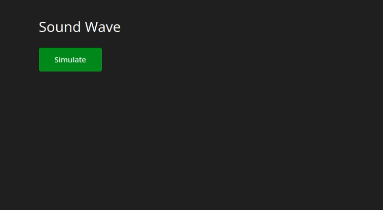

## Sound Wave

View [live app here](https://shiny-sound-wave.mwavu.com)

This example shows how to use this soundwave as a loading animation for long calculations.

Inspired by [@atherosai](https://github.com/atherosai/ui/tree/main/animation-01).
